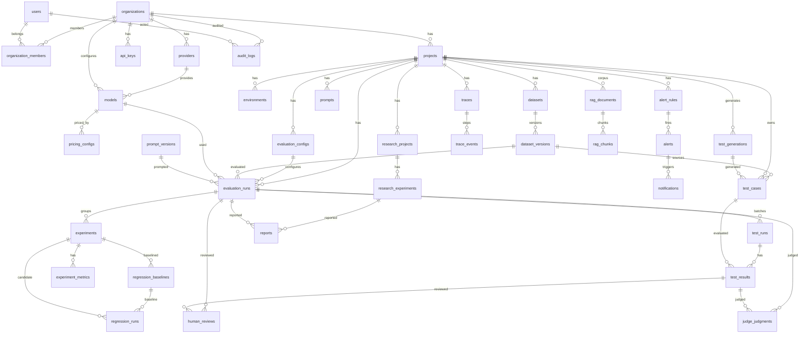

# Entity-Relationship Diagram — AIREX

Relationships for every entity defined in [`DATABASE_SCHEMA.md`](./DATABASE_SCHEMA.md). Notation:

- `1 ──< n` one-to-many · `n >─< n` many-to-many (via join table) · `||` mandatory · `o|` optional
- `◆` = tenant-owned (RLS) · `◆v` = tenant-owned + version-immutable

---

## 1. Mermaid ER Diagram (renders in GitHub/VS Code)



---

## 2. Text ERD by Domain

### 2.1 Identity & Tenancy
```
users ||──o< organization_members >o──|| organizations
users ||──o< api_keys (created_by)
organizations ||──o< api_keys
users ||──o< audit_logs (actor)
organizations ||──o< audit_logs
```

### 2.2 Projects / Environments / Providers / Models
```
organizations ||──o< projects
projects ||──o< environments
environments o|──>|| models (per-env model)
organizations ||──o< providers
providers ||──o< models
organizations ||──o< models
models ||──o< pricing_configs   (1..n versioned)
projects o|──o< environments
```

### 2.3 Datasets & Tests
```
projects ||──o< datasets
datasets ||──o< dataset_versions      (1..n; immutable)
dataset_versions o|──o< test_cases
projects ||──o< test_cases
projects ||──o< test_generations
test_generations ||──o< test_cases    (generated set, versioned)
evaluation_runs ||──o< test_runs
test_runs ||──o< test_results
test_cases ||──o< test_results
```

### 2.4 Evaluation / Experiments / Prompts / Regression
```
projects ||──o< evaluation_configs (versioned)
projects ||──o< prompts
prompts ||──o< prompt_versions (immutable)
datasets ◈ ──o< evaluation_runs (via dataset_version_id)
models ◈ ──o< evaluation_runs
prompt_versions ◈ ──o< evaluation_runs
evaluation_configs ◈ ──o< evaluation_runs
evaluation_runs ◈ ──o< test_runs
experiments (immutable) 
  ├──o< experiment_metrics
  ├──o< regression_baselines
regression_baselines ||──o< regression_runs (baseline)
experiments ||──o< regression_runs (candidate)
```

### 2.5 Observability
```
projects ||──o< traces (partitioned)
traces ||──o< trace_events (partitioned)
projects ||──o< metrics_samples (partitioned)
projects ||──o< metric_aggregates
```

### 2.6 Alerts / Notifications
```
projects ||──o< alert_rules
alert_rules ||──o< alerts
alerts ||──o< notifications  (1..n)
organizations ||──o< notifications
users o|──o< notifications
```

### 2.7 Research / Reporting
```
projects ||──o< research_projects
research_projects ||──o< research_experiments
research_experiments o|──o< reports
evaluation_runs o|──o< reports
experiments o|──o< reports
projects ||──o< exports
```

### 2.8 Human Review / Judge
```
evaluation_runs ||──o< human_reviews
test_results ||──o< human_reviews
users ||──o< human_reviews (reviewer)
evaluation_runs ||──o< judge_judgments (write-once)
test_results ||──o< judge_judgments
organizations ||──o< calibration_samples
```

### 2.9 Audit / Events
```
organizations ||──o< audit_logs (append-only)
users ||──o< audit_logs
outbox_events (standalone, no tenant FK — event log)
```

### 2.10 Vector
```
projects ||──o< rag_documents
rag_documents ||──o< rag_chunks (embedding VECTOR, HNSW)
```

---

## 3. Cardinality & Key Facts

| Relationship | Cardinality | Key | Constraint |
|--------------|-------------|-----|------------|
| users ↔ organizations | n:m | organization_members(organization_id,user_id) | PK(org,user); role |
| organizations → projects | 1:n | projects.organization_id | |
| projects → environments | 1:n | environments.project_id | unique(project,name) |
| providers → models | 1:n | models.provider_id | unique(org,provider,model_ref,version) |
| models → pricing_configs | 1:n | pricing_configs.model_id | unique(model,version_no); immutable |
| datasets → dataset_versions | 1:n | dataset_versions.dataset_id | unique(dataset,version_no); immutable |
| dataset_versions → test_cases | 1:n | test_cases.dataset_version_id | |
| evaluation_configs → evaluation_runs | 1:n | evaluation_runs.evaluation_config_id | versioned |
| evaluation_runs → test_runs → test_results | 1:n:n | FK chain | results write-once |
| evaluation_runs → experiments | 1:n (run completes into experiment) | experiments refs run/dataset/model/prompt | experiment immutable after completion |
| experiments → regression_baselines | 1:n | baseline.experiment_id | unique(project,experiment) |
| regression_runs ↔ experiments | n:n (baseline/candidate) | two FKs | snapshot threshold_policy |
| traces → trace_events | 1:n | trace_events.trace_id | unique(trace,sequence); partitioned |
| alert_rules → alerts → notifications | 1:n:1..n | FK chain | dedup_key unique on notifications |
| research_projects → research_experiments | 1:n | FK | immutable after completed |
| test_results ↔ human_reviews | 1:n | FK(test_result_id,reviewer_id) | unique(test_result,reviewer) |

---

## 4. Version-Immutable (◆v) Sub-graph

```
dataset_versions ◈ ──o< evaluation_runs ──o< test_results
prompt_versions ◈ ──o< evaluation_runs
evaluation_configs ◈ ──o< evaluation_runs
pricing_configs ◈ ──o< (cost engine)
evaluators ◈ ──o< evaluation_configs.evaluator_versions
experiments ◈ (immutable after completion)
judge_judgments ◈ (write-once)
audit_logs ◈ (append-only)
```

This sub-graph guarantees PRD §16, §34, §35, §78 (reproducibility): every run references exact immutable versions.

---

## 5. RLS Scoping

Every ◆ (tenant-owned) table is scoped by `organization_id` via RLS (see [`DATABASE_SCHEMA.md`](./DATABASE_SCHEMA.md) §5). Exemptions: `audit_logs` (admins), production `environments` (FR-ENV-003 elevation).

## 6. PRD Traceability (ERD)

| PRD §10 org containment (users/projects/api_keys/models/datasets/experiments/reports) | Reflected: organizations → {members, projects, api_keys, models, datasets→experiments, reports} |
| §53 core entities | All 27 §53 tables present and related |
| §16/§34/§78 immutability + versioning | §4 immutable sub-graph |
| §54 vector (doc→chunk) | rag_documents → rag_chunks |
| §42 trace steps | traces → trace_events (ordered) |
| §43 alert chain | alert_rules → alerts → notifications |
| §47–§48 research | research_projects → research_experiments (+ statistics) |
| §72–§75 human review/judge | human_reviews, judge_judgments, calibration_samples |
