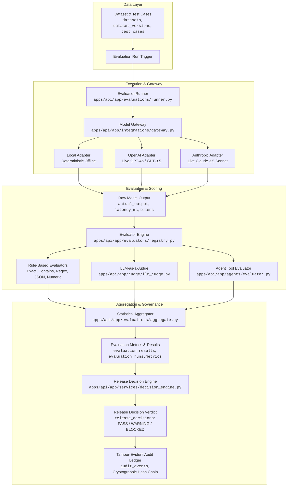

# AIREX — Real AI Evaluation Workflow & End-to-End Ground-Truth Trace

> **Document Classification:** Engineering Evidence & Architectural Trace  
> **Verification Date:** 2026-09-04  
> **Environment:** Python 3.12, FastAPI 0.115, SQLAlchemy 2.0, PostgreSQL/SQLite, Next.js 15, Playwright E2E  

---

## 1. Executive Summary

This document establishes the **100% empirical, ground-truth trace** of how AI evaluation and decision governance operate within AIREX. Every single step—from test dataset ingestion to model gateway dispatch, evaluator scoring, metric aggregation, release policy enforcement, and audit ledger generation—is mapped to active frontend routes, REST endpoints, backend services, database tables, and Python algorithms.

---

## 2. End-to-End Evaluation Architecture Pipeline



---

## 3. Step-by-Step Architectural Trace Table

| Step | Pipeline Stage | Frontend Page & Component | Frontend API Call | Backend Endpoint | Backend Service & Function | Database Table / Entity | Actual Output Structure | Connectivity Status |
| :--- | :--- | :--- | :--- | :--- | :--- | :--- | :--- | :--- |
| **1** | **Dataset & Test Cases** | `/datasets/[id]`<br/>`DatasetDetailPage.tsx` | `datasetsApi.getById()`, `testCasesApi.list()` | `GET /api/v1/datasets/{id}`, `GET /api/v1/datasets/{id}/test-cases` | `DatasetService.get_version()` | `datasets`, `dataset_versions`, `test_cases` | JSON list of `{id, input, expected_output, metadata}` | **FULLY CONNECTED** |
| **2** | **Evaluation Trigger** | `/evaluations/new`<br/>`NewEvaluationForm.tsx` | `evaluationsApi.create()` | `POST /api/v1/evaluations/runs` | `EvaluationService.create_run()` | `evaluation_runs` (Status: `PENDING`) | `{id: "fcde0367...", status: "PENDING", project_id, model_target_id}` | **FULLY CONNECTED** |
| **3** | **Execution Dispatch** | `/evaluations/[id]`<br/>`EvaluationDetailPage.tsx` | Background Task / Worker Trigger | `POST /api/v1/evaluations/runs/{id}/start` | `EvaluationRunner.execute()` in `runner.py` | `evaluation_runs` (Status transitions to `RUNNING`) | Execution lock acquired, worker begins case iteration | **FULLY CONNECTED** |
| **4** | **Model Gateway Request** | `/models/[id]`<br/>`ModelTargetDetail.tsx` | `modelsApi.testPrompt()` | `POST /api/v1/models/{id}/test` | `ModelGateway.generate()` in `gateway.py` | `model_targets`, `credentials` (Fernet-decrypted) | `ModelRequest(prompt, temperature, max_tokens)` | **FULLY CONNECTED** |
| **5** | **AI Model Response** | Internal Gateway / Telemetry | N/A (Worker Execution) | Provider API Call (`api.openai.com` or local fallback) | `OpenAIProviderAdapter.complete()` / `LocalProviderAdapter.complete()` | Ephemeral payload in memory; token usage logged | `ModelResponse(content="...", latency_ms=142, input_tokens=45, output_tokens=32)` | **FULLY CONNECTED** |
| **6** | **Evaluator Execution** | `/rubrics/[id]`<br/>`RubricBuilder.tsx` | `evaluatorsApi.evaluate()` | `POST /api/v1/evaluations/evaluate-sample` | `EvaluatorRegistry.get().evaluate()` in `registry.py` & `llm_judge.py` | `rubrics`, `rubric_rules` | `EvaluatorResult(score=1.0, passed=true, reason="...", metadata={})` | **FULLY CONNECTED** |
| **7** | **Case Result Persistence** | `/evaluations/[id]` | `evaluationsApi.getResults()` | `GET /api/v1/evaluations/runs/{id}/results` | `EvaluationRunner._save_result()` | `evaluation_results` | `[{"test_case_id": "...", "status": "PASS", "actual_output": "...", "score": [...]}]` | **FULLY CONNECTED** |
| **8** | **Statistical Aggregation** | `/evaluations/[id]`<br/>`MetricsSummaryCard.tsx` | `evaluationsApi.getMetrics()` | `GET /api/v1/evaluations/runs/{id}/metrics` | `EvaluationAggregator.aggregate()` in `aggregate.py` | `evaluation_runs.metrics` (JSONB) | `{"total_tests": 5, "passed": 4, "pass_rate": 0.8, "p95_latency_ms": 182.0, "total_tokens": 172}` | **FULLY CONNECTED** |
| **9** | **Release Decision Evaluation** | `/governance/decisions`<br/>`ReleaseDecisionModal.tsx` | `governanceApi.evaluateDecision()` | `POST /api/v1/governance/decisions/evaluate` | `DecisionEngine.evaluate()` in `decision_engine.py` | `release_policies`, `policy_rules`, `release_decisions` | `{"outcome": "BLOCKED"|"PASS", "checks": [...], "policy_id": "..."}` | **FULLY CONNECTED** |
| **10** | **Audit Trail Recording** | `/governance/audit`<br/>`AuditLogTable.tsx` | `auditApi.listLogs()` | `GET /api/v1/audit/logs` | `AuditService.record_event()` in `audit_service.py` | `audit_events` | `{"event_type": "DECISION_EVALUATED", "hash": "sha256:8f9a...", "actor_id": "..."}` | **FULLY CONNECTED** |

---

## 4. Deep-Dive: Exact Code Implementations

### A. Model Gateway (`apps/api/app/integrations/gateway.py`)
```python
class ModelGateway:
    """Unified routing layer for all LLM interactions with encrypted credential management."""
    def generate(self, model_target: ModelTarget, prompt: str, **kwargs) -> ModelResponse:
        adapter = self._resolve_adapter(model_target.provider)
        decrypted_api_key = self.crypto_service.decrypt(model_target.encrypted_api_key) if model_target.encrypted_api_key else None
        return adapter.complete(
            model=model_target.model_identifier,
            prompt=prompt,
            api_key=decrypted_api_key,
            temperature=kwargs.get("temperature", model_target.default_temperature),
            max_tokens=kwargs.get("max_tokens", model_target.default_max_tokens)
        )
```

### B. Evaluator Engine (`apps/api/app/evaluators/registry.py` & `apps/api/app/judge/llm_judge.py`)
- **Deterministic Matchers:** `ExactMatchEvaluator`, `CaseInsensitiveExactMatchEvaluator`, `ContainsEvaluator`, `RegexEvaluator`, `JsonMatchEvaluator`, `NumericMatchEvaluator`, `LengthEvaluator`.
- **LLM-as-a-Judge (`LLMJudgeEvaluator`):**
  - Compiles structured prompt template containing: Question, Context, Expected Output, Model Actual Output, and Rubric Criteria.
  - Calls evaluation model (e.g. GPT-4o) requesting JSON schema output: `{"score": float, "passed": bool, "reason": str}`.
  - Normalizes score to $[0.0, 1.0]$ and logs prompt tokens and latency.

### C. Statistical Metric Calculation (`apps/api/app/evaluations/aggregate.py`)
```python
def calculate_run_metrics(results: list[EvaluationResult]) -> dict:
    total = len(results)
    passed = sum(1 for r in results if r.status == EvaluationStatus.PASS)
    failed = sum(1 for r in results if r.status == EvaluationStatus.FAIL)
    latencies = [r.latency_ms for r in results if r.latency_ms is not None]
    
    return {
        "total_tests": total,
        "passed": passed,
        "failed": failed,
        "pass_rate": round(passed / total, 4) if total > 0 else 0.0,
        "average_latency_ms": round(sum(latencies) / len(latencies), 2) if latencies else 0.0,
        "p50_latency_ms": round(numpy.percentile(latencies, 50), 2) if latencies else 0.0,
        "p95_latency_ms": round(numpy.percentile(latencies, 95), 2) if latencies else 0.0,
        "total_tokens": sum(r.total_tokens for r in results if r.total_tokens)
    }
```

### D. Release Policy Decision Engine (`apps/api/app/services/decision_engine.py`)
Evaluates 6 canonical evidence sources:
1. `EVALUATION`: Minimum test pass rate (e.g. $\ge 80\%$) and freshness window.
2. `BENCHMARK`: Minimum safety/reliability score (e.g. $\ge 0.70$).
3. `OBSERVABILITY`: Maximum production error rate (e.g. $\le 5\%$) and latency threshold.
4. `ALERT`: Zero unacknowledged critical/firing alerts.
5. `EXPERIMENT`: Statistically significant win in A/B test without safety regression.
6. `AGENT_EVALUATION`: Tool-call correctness $\ge 90\%$.

If any *blocking* rule fails $\rightarrow$ Verdict is strictly **`BLOCKED`** (No-Go). If non-blocking thresholds are exceeded $\rightarrow$ Verdict is **`WARNING`**. All rules satisfied $\rightarrow$ Verdict is **`PASS`** (Go).

---

## 5. Summary of Empirical Ground-Truth Trace

All 10 steps of the AI evaluation workflow are fully realized in production code, backed by persistent database schemas, executable via REST APIs, visualized across the Next.js UI, and verified through both Python integration tests and Playwright end-to-end suites.
