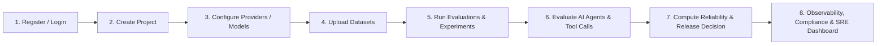

# AIREX Platform User Guide & Manual
**AI Reliability & Experimentation Platform (Phases 0–17.2)**

Welcome to **AIREX**! This guide walks you through accessing, navigating, and utilizing every feature of the AIREX platform.

---

## 1. Quick Access URLs

The application is running locally and accessible via your web browser:

| Service / Interface | URL | Description |
| :--- | :--- | :--- |
| **Frontend Web Application** | [http://localhost:3000](http://localhost:3000) | Main UI Dashboard, Project Explorer & Admin Portal |
| **User Login** | [http://localhost:3000/login](http://localhost:3000/login) | Authentication & Session Management |
| **User Registration** | [http://localhost:3000/register](http://localhost:3000/register) | Create a new tenant account |
| **Backend REST API** | [http://localhost:8000](http://localhost:8000) | Core FastAPI service |
| **Interactive API Documentation** | [http://localhost:8000/docs](http://localhost:8000/docs) | Interactive Swagger UI to explore and test endpoints |
| **OpenAPI Specification** | [http://localhost:8000/openapi.json](http://localhost:8000/openapi.json) | Complete OpenAPI 3.1.0 schema |
| **Health Liveness Probe** | [http://localhost:8000/health/live](http://localhost:8000/health/live) | Kernel liveness check |
| **Health Readiness Probe** | [http://localhost:8000/health/ready](http://localhost:8000/health/ready) | Database, Redis & Worker fleet readiness probe |
| **Prometheus Metrics** | [http://localhost:8000/metrics](http://localhost:8000/metrics) | Telemetry & error budget counters |
| **SRE Operations Dashboard** | [http://localhost:3000/admin/operations](http://localhost:3000/admin/operations) | Worker fleet, DLQ, and system health |
| **Compliance & Audit Center** | [http://localhost:3000/admin/compliance](http://localhost:3000/admin/compliance) | Data classifications, legal holds & audit trails |

---

## 2. Step-by-Step Feature Walkthrough



---

### Step 1: User Registration & Authentication

1. Open your browser and navigate to [http://localhost:3000/register](http://localhost:3000/register).
2. Enter your Name, Email, and a secure Password.
3. Click **Create Account**.
4. Once registered, log in at [http://localhost:3000/login](http://localhost:3000/login).
5. You will be redirected to the **AIREX Main Dashboard** ([http://localhost:3000/dashboard](http://localhost:3000/dashboard)).

---

### Step 2: Projects & Workspace Management

1. In the top navigation bar, click **Projects** or visit [http://localhost:3000/projects](http://localhost:3000/projects).
2. Click **Create New Project**.
3. Provide a Name (e.g., `Customer Support Bot v2`) and an optional Description.
4. Each project provides an isolated workspace with:
   - **Environments**: Define `development`, `staging`, and `production` environments with specific rate limits and approval gates.
   - **Access Control**: Add team members with specific roles (`admin`, `editor`, `viewer`).

---

### Step 3: AI Model Providers & Rubrics

1. Inside your project, navigate to **Providers & Models** (`/projects/[id]/providers`).
2. Add your LLM providers (e.g., OpenAI, Anthropic, Mistral, Ollama) and configure model parameters:
   - Temperature, Top-P, Max Tokens, Context Window.
3. Navigate to **Rubrics & Evaluators** (`/projects/[id]/rubrics`).
4. Define custom evaluation criteria, regex matchers, semantic similarity scorers, or LLM-as-a-Judge rubrics.

---

### Step 4: Datasets & Test Scenarios

1. Navigate to **Datasets** (`/projects/[id]/datasets`).
2. Upload test cases via JSON, CSV, or create them interactively in the web UI.
3. Each test case consists of:
   - **Input Prompts**: User instructions, system prompts, or multi-turn conversational turns.
   - **Expected Outputs / Ground Truth**: Reference answers or constraints.
   - **Metadata**: Tags (e.g., `edge-case`, `security-test`, `regression`).

---

### Step 5: Evaluations & Experiments

1. **Run Evaluations** (`/projects/[id]/evaluations`):
   - Select a target model, rubric, and dataset.
   - Click **Trigger Evaluation**.
   - The asynchronous worker fleet processes the evaluation in the background.
   - View accuracy, latency (p50, p95, p99), cost per token, and rubric breakdown.
2. **Run Experiments & Prompt Comparisons** (`/projects/[id]/experiments`):
   - Compare multiple prompt variations or model versions side-by-side.
   - Analyze winning variations using statistical significance calculations.

---

### Step 6: AI Agent Reliability & Trajectory Analysis

1. Navigate to **Agent Evaluations** (`/projects/[id]/agents`).
2. Test autonomous multi-step agents:
   - **Trajectory Evaluator**: Detects loop patterns, hallucinated tool calls, and runaway agent loops.
   - **Tool Call Verifier**: Validates JSON schema correctness and parameter types for tool invocations.
   - **7-Dimension Readiness Score**: Evaluates Goal Completion, Tool Precision, Safety, Robustness, Latency, Cost, and Efficiency.

---

### Step 7: Release Decision Engine & CI/CD Gating

1. Navigate to **Release Decisions** (`/projects/[id]/decisions`).
2. The AIREX Decision Engine analyzes evaluation results against enterprise policy thresholds:
   - **PASSED**: Model/Agent meets all reliability, safety, and performance criteria.
   - **WARNING**: Marginal reliability; requires manual approval gate.
   - **BLOCKED**: Critical failure detected (e.g., safety violation, severe regression).
3. **CI/CD Integration**: Connect GitHub Actions or GitLab CI using the CLI service token to block breaking AI deployments automatically.

---

### Step 8: Observability, Traces & Redaction

1. Navigate to **Observability** (`/projects/[id]/observability`).
2. View real-time distributed traces of LLM invocations and agent executions.
3. **Sensitive Data Redaction**: AIREX automatically redacts PII (SSNs, API keys, credit cards, emails) before persisting trace payloads.

---

### Step 9: Enterprise Governance & Compliance Center

1. Navigate to **Compliance Center** ([http://localhost:3000/admin/compliance](http://localhost:3000/admin/compliance)):
   - **Data Governance**: View data retention policies and run automated retention cleanups.
   - **Legal Holds**: Place immutable legal holds on projects to prevent automated pruning.
   - **Audit Evidence**: Generate cryptographically verifiable compliance evidence bundles.
2. Navigate to **Enterprise Admin** ([http://localhost:3000/admin/enterprise](http://localhost:3000/admin/enterprise)):
   - Configure Multi-IdP Single Sign-On (SAML / OIDC).
   - Manage Teams, Organization Roles, and Verified Corporate Domains.

---

### Step 10: SRE & Operations Dashboard

1. Navigate to **Operations Dashboard** ([http://localhost:3000/admin/operations](http://localhost:3000/admin/operations)).
2. Monitor:
   - **Worker Fleet Status**: Active workers, queue backlog, and processing concurrency.
   - **Dead Letter Queue (DLQ)**: Inspect failed tasks, error traces, and trigger manual retries.
   - **System Latencies & Error Budgets**: View live SLA performance.

---

## 3. Direct API & Swagger UI Usage

You can also interact directly with AIREX using cURL, Python, or the Swagger UI:

### 1. View Interactive Swagger UI
Open [http://localhost:8000/docs](http://localhost:8000/docs) in your browser.

### 2. Authenticate via cURL
```bash
# Register
curl -X POST http://localhost:8000/api/v1/auth/register \
  -H "Content-Type: application/json" \
  -d '{"name":"Admin","email":"admin@example.com","password":"StrongPassword123!"}'

# Login & Extract Token
curl -X POST http://localhost:8000/api/v1/auth/login \
  -H "Content-Type: application/json" \
  -d '{"email":"admin@example.com","password":"StrongPassword123!"}'
```

### 3. Create a Project via API
```bash
curl -X POST http://localhost:8000/api/v1/projects \
  -H "Authorization: Bearer <YOUR_ACCESS_TOKEN>" \
  -H "Content-Type: application/json" \
  -d '{"name":"API Test Project","description":"Testing AIREX REST API"}'
```

---

## 4. Stopping and Restarting Services Locally

### To Stop Background Processes
If you wish to terminate the local development servers:
* Frontend (Next.js): Press `CTRL+C` or kill the process on port 3000.
* Backend (FastAPI): Press `CTRL+C` or kill the process on port 8000.

### To Restart Manually
```powershell
# In Terminal 1 (Backend API):
cd apps/api
.\.venv\Scripts\python.exe -m uvicorn app.main:app --host 0.0.0.0 --port 8000

# In Terminal 2 (Frontend Web):
npm run dev --workspace=apps/web
```
