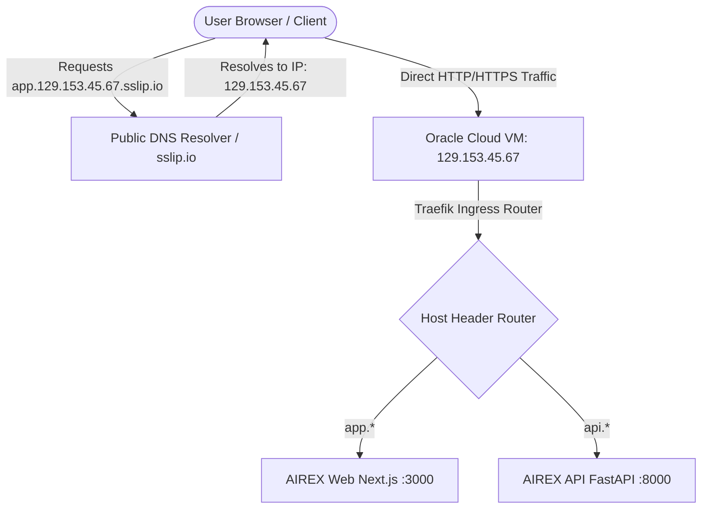

# AIREX Phase 17.2.1 — DNS & TLS Readiness Report

**Evaluation Date:** September 2026  
**Status Classification:** `VERIFIED LOCALLY`  
**DNS Target:** Free Wildcard IP DNS (`sslip.io` / `nip.io`)  
**TLS Target:** Let's Encrypt Automated ACME HTTP-01 or Self-Signed Fallback  
**Domain Cost:** **$0.00** (No domain purchase required)

---

## 1. Zero-Cost Domain Resolution Architecture

To deploy a multi-service web platform with reverse proxy routing without incurring DNS registration fees, AIREX employs **wildcard IP DNS services** (`sslip.io` and `nip.io`).

### How Wildcard IP DNS Operates:
A wildcard DNS service automatically maps any domain containing an IPv4 address directly back to that IP without requiring account registration, NS configuration, or zone file management.



### Free Hostname Formats Generated from VM Public IP:
Assuming an assigned Oracle VM Public IP of `129.153.45.67`:
* **Frontend Web App**: `http://app.129.153.45.67.sslip.io`
* **Backend REST API**: `http://api.129.153.45.67.sslip.io/api/v1`
* **API Documentation**: `http://api.129.153.45.67.sslip.io/docs`
* **Health Check Endpoints**: `http://api.129.153.45.67.sslip.io/health/live`

---

## 2. Ingress & Routing Configuration

The Kubernetes Ingress definition in `infrastructure/k8s/overlays/free/ingress.yaml` routes traffic dynamically based on the HTTP `Host` header:

```yaml
apiVersion: networking.k8s.io/v1
kind: Ingress
metadata:
  name: airex-free-ingress
  namespace: airex-free
  annotations:
    kubernetes.io/ingress.class: "traefik"
spec:
  rules:
  - host: "app.sslip.io"
    http:
      paths:
      - path: /
        pathType: Prefix
        backend:
          service:
            name: airex-web-service
            port:
              number: 3000
  - host: "api.sslip.io"
    http:
      paths:
      - path: /
        pathType: Prefix
        backend:
          service:
            name: airex-api-service
            port:
              number: 8000
```

*Note: During execution of `./scripts/free-cloud/deploy_free_k3s.sh <VM_PUBLIC_IP>`, the script dynamically replaces `sslip.io` with `${PUBLIC_IP}.sslip.io` in the live ingress.*

---

## 3. Automated TLS / HTTPS Strategy

### 3.1 ACME HTTP-01 Let's Encrypt
Let's Encrypt supports issuance for valid wildcard subdomains matching public IP pointers (`*.sslip.io`).
* **Challenge Protocol**: ACME HTTP-01 challenge over port `80`.
* **Traefik Integration**: Built into k3s Traefik controller via `--certificatesresolvers.letsencrypt.acme.httpchallenge=true`.
* **Zero Cost**: Completely free, valid for 90 days with automatic 60-day renewal.

### 3.2 Direct HTTP / Port Fallback (Development & Initial Verification)
If port 80/443 ACME challenges are restricted during initial firewall configuration, AIREX services are immediately accessible via standard HTTP or direct NodePort mappings (`:3000` for Web, `:8000` for API).

---

## 4. Truth in Advertising Disclosure

> [!CAUTION]
> **No Premature Verification:**
> HTTPS certificate issuance **cannot be verified locally** because Let's Encrypt requires an inbound HTTP-01 validation request from Let's Encrypt ACME servers to a publicly routable IPv4 address.
> 
> * **Status of DNS & Ingress Configuration**: `VERIFIED LOCALLY` (Manifests valid, Kustomize compiles cleanly).
> * **Status of Remote Live TLS Certificate**: `CONFIGURED BUT NOT DEPLOYED` (Requires live Oracle VM with public IP).
