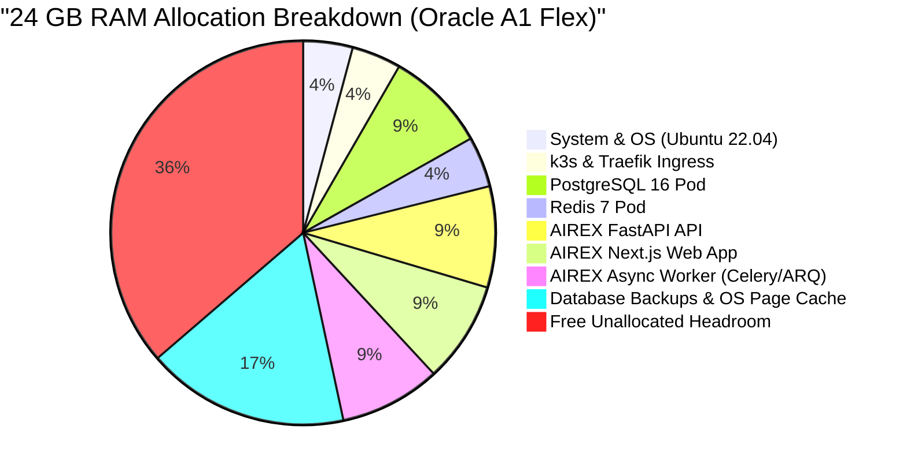

# AIREX Phase 17.2.1 — Free Resource Budget Report

**Evaluation Date:** September 2026  
**Status Classification:** `VERIFIED LOCALLY`  
**Target Hardware:** Oracle Cloud Always Free `VM.Standard.A1.Flex` (Ampere Altra ARM64)

---

## 1. Oracle Always Free Compute Specifications

| Resource Dimension | Always Free Quota (A1 Flex ARM) | Fallback Shape (`VM.Standard.E2.1.Micro` AMD) |
| :--- | :--- | :--- |
| **CPU Architecture** | 4 OCPU (Ampere Altra ARMv8.2+ aarch64) | 1 OCPU (AMD EPYC x86_64, 1/8 core burstable) |
| **System RAM** | 24 GB RAM (Configurable up to 24 GB free) | 1.0 GB RAM |
| **Block Storage** | 200 GB NVMe Block Storage free | 50 GB standard storage |
| **Network Bandwidth** | 4 Gbps Network Bandwidth | 480 Mbps |
| **Monthly Egress** | 10 TB free outbound data transfer / month | 10 TB free outbound data transfer / month |
| **Monthly Cloud Cost** | **$0.00** | **$0.00** |

---

## 2. Resource Utilization Budget on A1 Flex ARM (Primary Topology)

The primary free deployment topology runs single-replica microservices inside single-node `k3s` on the 4 OCPU / 24 GB ARM instance.



### Detailed Component Budget Table

| Component | CPU Request | CPU Limit | RAM Request | RAM Limit | Persistent Disk Allocation |
| :--- | :--- | :--- | :--- | :--- | :--- |
| **Ubuntu 22.04 OS Kernel** | 100m | — | 512 MB | 1024 MB | 10 GB (Root FS) |
| **k3s Control Plane + Containerd** | 200m | 500m | 400 MB | 768 MB | Included in Root FS |
| **Traefik Ingress Controller** | 50m | 200m | 64 MB | 256 MB | Stateless |
| **PostgreSQL 16 Database** | 250m | 1000m | 512 MB | 2048 MB | 10 GB PVC (`postgres-pvc`) |
| **Redis 7 In-Memory Store** | 100m | 500m | 128 MB | 1024 MB | 2 GB PVC (`redis-pvc`) |
| **AIREX API (FastAPI / Uvicorn)** | 300m | 1500m | 512 MB | 2048 MB | Stateless |
| **AIREX Web (Next.js Standalone)** | 200m | 1000m | 256 MB | 2048 MB | Stateless |
| **AIREX Worker (Async Engine)** | 300m | 1500m | 512 MB | 2048 MB | Stateless |
| **Local Database Backups (`/var/airex/`)** | Burst (I/O) | 500m | 128 MB | 512 MB | 20 GB Local Storage |
| **TOTAL ALLOCATED** | **1500m (1.5 OCPU)** | **6700m (Burstable)** | **2512 MB (~2.5 GB)** | **10688 MB (~10.7 GB)** | **~42 GB / 200 GB Available** |
| **FREE HEADROOM AVAILABLE** | **2500m (2.5 OCPU)** | **Available** | **21.5 GB Available** | **13.3 GB Uncommitted** | **158 GB Available** |

> [!NOTE]
> On the 4 OCPU / 24 GB RAM shape, AIREX operates with **over 55% unallocated RAM headroom**, ensuring zero risk of Linux Out-Of-Memory (OOM) killer terminations during large batch evaluations or heavy database migrations.

---

## 3. Minimal Fallback Budget (`VM.Standard.E2.1.Micro` AMD — 1 GB RAM)

If Oracle Cloud runs out of Ampere ARM capacity in the user's home region, the AMD Micro instance can be used as a constrained fallback.

### Required Optimizations for 1 GB RAM:
1. **Bypass k3s**: Use `docker-compose.yml` directly to eliminate Kubernetes control plane memory overhead (~600 MB savings).
2. **PostgreSQL Tuning**: Set `shared_buffers = 128MB` and `work_mem = 4MB`.
3. **Redis Maxmemory**: Cap Redis at `maxmemory 128mb` with `maxmemory-policy allkeys-lru`.
4. **Worker Concurrency**: Limit worker to `concurrency=1`.
5. **Next.js Standalone Output**: Standalone build uses only ~80 MB idle RAM.
6. **Swap File**: Create a 2 GB swap file on the 50 GB boot volume to absorb short evaluation spikes:
   ```bash
   sudo fallocate -l 2G /swapfile && sudo chmod 600 /swapfile && sudo mkswap /swapfile && sudo swapon /swapfile
   ```

### 1 GB RAM Breakdown:
* OS & Docker Engine: 200 MB
* PostgreSQL 16: 200 MB
* Redis 7: 64 MB
* AIREX API (1 worker): 220 MB
* AIREX Web (Next.js): 120 MB
* AIREX Worker (1 worker): 150 MB
* **Total Active RAM**: **954 MB / 1024 MB** (Supported via 2 GB swap buffer).

---

## 4. Resource Allocation Verification

All Kubernetes manifests in `infrastructure/k8s/overlays/free/` and base definitions enforce explicit `resources.requests` and `resources.limits` to guarantee that no pod can monopolize memory or exhaust disk capacity.
