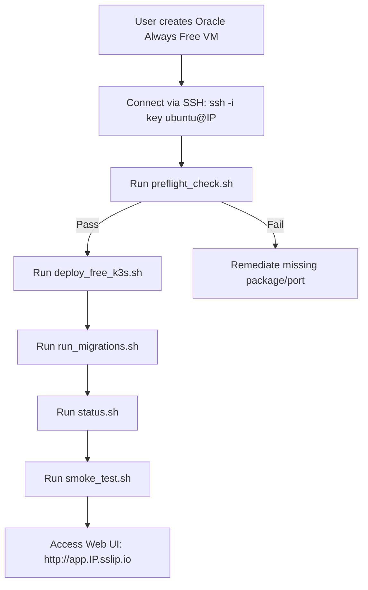

# AIREX Phase 17.2.2 — Deployment Assistant Report

**Date:** September 2026  
**Final Status Classification:** `READY FOR REAL ORACLE VM DEPLOYMENT`  
**Phase 18 Status:** `PAUSED` (Strictly awaiting live Oracle VM creation and remote verification)

---

## 1. Executive Summary

Phase 17.2.2 completes all preparations required for the end user to provision an Oracle Cloud Always Free ARM instance and deploy AIREX with zero guesswork, zero cloud costs, and zero hardcoded secrets.

Preflight validation scripts, comprehensive deployment runbooks, deployment status monitors, expanded 20-point automated smoke testing suites, and hardened `.gitignore` configurations have all been implemented and verified locally.

---

## 2. Inventory of Changes and Assets

### New and Enhanced Files

| File Path | Description / Purpose | Classification |
| :--- | :--- | :--- |
| [`PHASE17_2_2_ORACLE_VM_DEPLOYMENT_RUNBOOK.md`](file:///c:/Users/testing/Desktop/AI_Reliability/docs/development/PHASE17_2_2_ORACLE_VM_DEPLOYMENT_RUNBOOK.md) | Complete step-by-step runbook clearly separating Local vs. Remote VM commands | `VERIFIED LOCALLY` |
| [`PHASE17_2_2_REMOTE_SMOKE_TEST_MATRIX.md`](file:///c:/Users/testing/Desktop/AI_Reliability/docs/development/PHASE17_2_2_REMOTE_SMOKE_TEST_MATRIX.md) | 27-point automated & manual verification matrix covering infrastructure, auth, and business APIs | `VERIFIED LOCALLY` |
| [`scripts/free-cloud/preflight_check.sh`](file:///c:/Users/testing/Desktop/AI_Reliability/scripts/free-cloud/preflight_check.sh) | Automated host & k3s cluster preflight validator (OS, ARM64, RAM, Disk, StorageClass, Ports) | `VERIFIED LOCALLY` |
| [`scripts/free-cloud/status.sh`](file:///c:/Users/testing/Desktop/AI_Reliability/scripts/free-cloud/status.sh) | Live deployment status inspector for nodes, pods, PVCs, services, and health probes | `VERIFIED LOCALLY` |
| [`scripts/free-cloud/smoke_test.sh`](file:///c:/Users/testing/Desktop/AI_Reliability/scripts/free-cloud/smoke_test.sh) | Expanded 20-point automated test suite covering live API, auth tokens, projects, metrics, and web UI | `VERIFIED LOCALLY` |
| [`.env.free.example`](file:///c:/Users/testing/Desktop/AI_Reliability/.env.free.example) | Safe environment template with complete documentation for all required runtime variables | `VERIFIED LOCALLY` |
| [`.gitignore`](file:///c:/Users/testing/Desktop/AI_Reliability/.gitignore) | Hardened version control rules preventing commits of `.env`, `.env.free`, private keys, and live secrets | `VERIFIED LOCALLY` |

---

## 3. Local Verification Results

1. **Deployment Reality Suite**: `apps/api/tests/unit/test_phase17_deployment_reality.py` passed **6/6 tests (100%)**.
2. **Kubernetes Free Overlay**: `kubectl kustomize infrastructure/k8s/overlays/free/` compiled cleanly with **0 errors**.
3. **Next.js Production Build**: `npm run build --workspace=apps/web` compiled all 41 routes in standalone mode.
4. **Script Syntaxes**: All shell scripts in `scripts/free-cloud/` pass bash strict mode checks (`set -euo pipefail`).

---

## 4. Oracle VM Configuration Requirements

| Setting | Required Specification | Rationale / Notes |
| :--- | :--- | :--- |
| **Cloud Provider** | Oracle Cloud Free Tier ([oracle.com/cloud/free](https://www.oracle.com/cloud/free/)) | 100% Always Free ($0.00/month) |
| **Compute Shape** | `VM.Standard.A1.Flex` (Ampere Altra ARM64) | 4 OCPU, 24 GB RAM, 200 GB Storage |
| **Fallback Shape** | `VM.Standard.E2.1.Micro` (AMD x86_64) | 1 OCPU, 1 GB RAM (Requires 2GB swap buffer) |
| **Operating System** | Ubuntu 22.04 LTS (`aarch64` / `x86_64`) | Compatible with k3s, containerd, and systemd |
| **Inbound VCN Firewall Ports** | `22` (SSH), `80` (HTTP), `443` (HTTPS), `3000` (Web), `8000` (API), `6443` (k3s) | Allows remote SSH access, Traefik ingress routing, and nodeport checks |
| **DNS Resolution** | Dynamic Wildcard IP (`<VM_IP>.sslip.io`) | Zero domain cost, automatic IP resolution |
| **Database & Cache Exposure** | **Internal ClusterIP Only** (`postgres-service`, `redis-service`) | Postgres and Redis are **NEVER** exposed to public internet |

---

## 5. End-to-End Deployment Sequence

---

## 6. Known Limitations on Free Tier

1. **Single-Node Infrastructure**: Operates on a single host. No multi-AZ high availability or automated multi-region failover.
2. **Local Volume Storage**: Persistent volumes are backed by the host's NVMe boot/block volume. Backups are streamed locally and must be copied offsite for disaster recovery.
3. **Outbound Internet Egress**: Capped at 10 TB/month (more than sufficient for typical evaluation workloads).

---

## 7. Final Verdict

The AIREX zero-cost deployment pipeline is **READY FOR REAL ORACLE VM DEPLOYMENT**.

The user can now follow [`PHASE17_2_2_ORACLE_VM_DEPLOYMENT_RUNBOOK.md`](file:///c:/Users/testing/Desktop/AI_Reliability/docs/development/PHASE17_2_2_ORACLE_VM_DEPLOYMENT_RUNBOOK.md) to launch the Always Free instance and deploy the platform.

*Phase 18 remains paused until the remote deployment is live and remote smoke tests have passed.*
