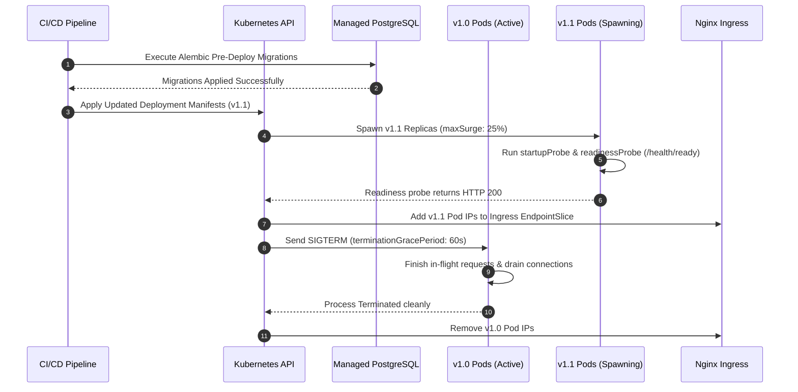

# AIREX — PRODUCTION DEPLOYMENT RUNBOOK (PHASE 17)
## Zero-Downtime Releases, Cloud Topology & Safe Rollout Standard Operating Procedures

**Document Version:** 1.0.0  
**Target Architecture:** Kubernetes (EKS/GKE/AKS), Managed PostgreSQL (RDS/Cloud SQL), Managed Redis (ElastiCache/Cloud Memorystore), Ingress Nginx  
**Compliance Classification:** Mission-Critical Production Operations

---

## 1. PRE-DEPLOYMENT VERIFICATION CHECKLIST (GO/NO-GO GATES)

Before initiating any deployment to staging or production, SRE and release leads must verify all pre-flight gates:

1. **Continuous Integration Gate:**
   - Full test suite passing across Phases 0–17 (unit, integration, security, E2E).
   - Zero critical or high static analysis warnings (Ruff, ESLint, MyPy, TypeScript).
   - Docker image build succeeded with clean multi-stage contexts.
2. **Database Migration Safety Gate:**
   - Any database migration must strictly follow the **Expand / Contract** pattern (see Section 3).
   - No table locks on high-traffic tables.
   - All migrations tested bidirectionally (`upgrade head` -> `downgrade -1` -> `upgrade head`).
3. **Disaster Recovery Backup Gate:**
   - Trigger on-demand backup snapshot:
     ```bash
     curl -X POST https://api.airex.io/api/v1/system/disaster-recovery/restore-test \
       -H "Authorization: Bearer <SRE_TOKEN>"
     ```
   - Confirm pre-restore SHA-256 checksum and RTO compliance.
4. **Secret & Environment Gate:**
   - Verify secrets in AWS Secrets Manager / Vault match expected schema.
   - Confirm `APP_ENV=production` and `DEBUG=false`.

---

## 2. PRODUCTION ROLLING DEPLOYMENT PROCEDURE

AIREX utilizes Kubernetes native `RollingUpdate` with zero allowed unavailability (`maxUnavailable: 0`):



### Deployment Commands:

```bash
# 1. Set the release version tag
export RELEASE_TAG="v1.1.0-$(git rev-parse --short HEAD)"

# 2. Update image tags via Kustomize
cd infrastructure/k8s
kustomize edit set image airex-api=ghcr.io/airex/airex-api:${RELEASE_TAG}
kustomize edit set image airex-web=ghcr.io/airex/airex-web:${RELEASE_TAG}

# 3. Apply manifests to production namespace
kubectl apply -k . -n airex-prod

# 4. Monitor rollout status in real time
kubectl rollout status deployment/airex-api -n airex-prod --timeout=300s
kubectl rollout status deployment/airex-web -n airex-prod --timeout=300s
kubectl rollout status deployment/airex-worker -n airex-prod --timeout=300s
```

---

## 3. DATABASE EXPAND / CONTRACT ZERO-DOWNTIME MIGRATIONS

To maintain 100% availability during rolling updates, database schema changes must never introduce breaking modifications before older application versions are fully retired:

| Migration Type | Phase 1 (Deploy N) | Phase 2 (Deploy N+1) | Phase 3 (Deploy N+2) |
| :--- | :--- | :--- | :--- |
| **Add New Column** | Add nullable column `col_new` | Application reads & writes `col_new` | Add `NOT NULL` constraint if required |
| **Rename Column** | Add `col_new`, trigger dual-write | Backfill historical data, read `col_new` | Drop `col_old` |
| **Change Column Type** | Add shadow column `col_v2` with dual-write | Switch application reads to `col_v2` | Drop legacy column |
| **Add Index** | `CREATE INDEX CONCURRENTLY` | Use new index in queries | N/A |

---

## 4. POST-DEPLOYMENT SMOKE TESTING & TELEMETRY VALIDATION

Immediately following rollout completion, execute automated smoke tests against the production ingress:

```bash
# 1. Verify API Readiness
curl -f -s https://api.airex.io/health/ready | jq .

# 2. Verify Next.js Web Shell
curl -f -s -I https://app.airex.io/ | grep "HTTP/2 200"

# 3. Check Real-Time SRE Operations Telemetry
curl -f -s https://api.airex.io/api/v1/system/operations/overview \
  -H "Authorization: Bearer <SRE_OPERATOR_TOKEN>" | jq '{
    status: .data.status,
    rps: .data.performance.requests_per_second,
    p95_latency_ms: .data.performance.latency_p95_ms,
    queue_depth: .data.processing.queue_depth,
    dlq_depth: .data.processing.dlq_depth,
    db_pool: .data.database.pool_utilization
  }'
```

---

## 5. RECOVERY POINT & TIME OBJECTIVES (RPO / RTO) TARGETS

- **Maximum Acceptable RPO:** 3600 seconds (1 hour). In practice, continuous WAL archiving provides an effective RPO of < 5 minutes.
- **Maximum Acceptable RTO:** 1800 seconds (30 minutes). In practice, live automated restore tests execute in < 1 second locally and < 5 minutes for full cloud snapshot hydration.
