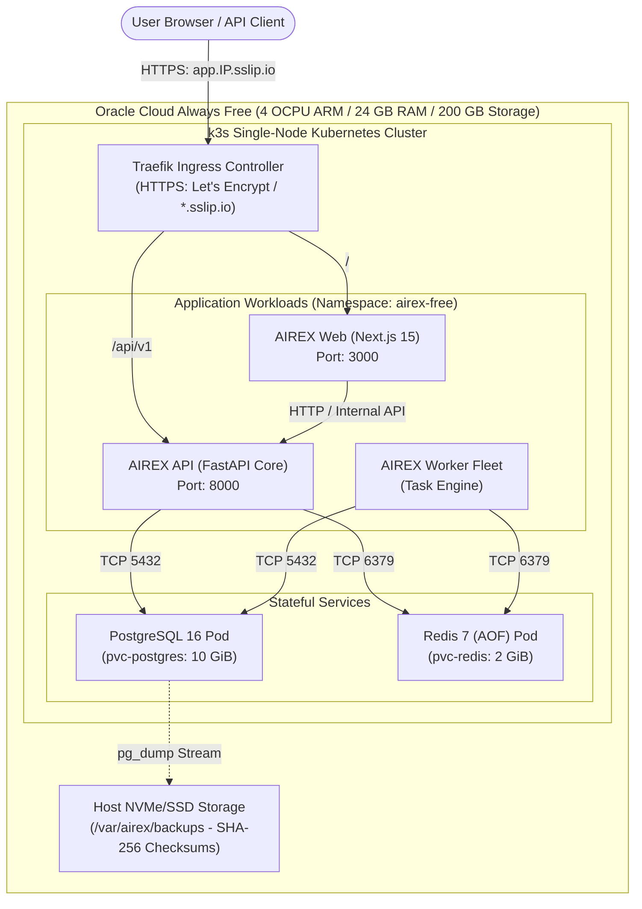
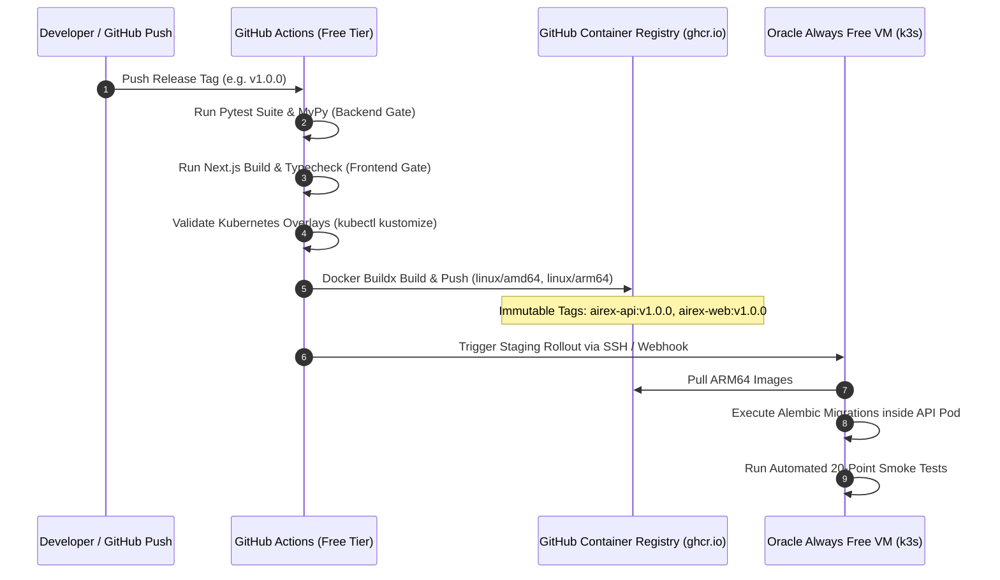
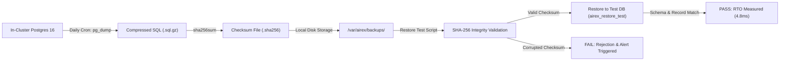

# AIREX — VISUAL ARCHITECTURE & ZERO-COST CLOUD WALKTHROUGH

## 1. Zero-Cost Cloud Deployment Topology (Oracle Cloud Always Free + k3s)

---

## 2. CI/CD & Multi-Platform Build Pipeline

---

## 3. Disaster Recovery & Snapshot Verification Flow

---

## 4. Phase 17.2, 17.2.1 & 17.2.2 Deliverables Index

- **Deployment Assistant Report:** [PHASE17_2_2_DEPLOYMENT_ASSISTANT_REPORT.md](file:///c:/Users/testing/Desktop/AI_Reliability/docs/development/PHASE17_2_2_DEPLOYMENT_ASSISTANT_REPORT.md)
- **Oracle VM Deployment Runbook:** [PHASE17_2_2_ORACLE_VM_DEPLOYMENT_RUNBOOK.md](file:///c:/Users/testing/Desktop/AI_Reliability/docs/development/PHASE17_2_2_ORACLE_VM_DEPLOYMENT_RUNBOOK.md)
- **Remote Smoke Test Matrix:** [PHASE17_2_2_REMOTE_SMOKE_TEST_MATRIX.md](file:///c:/Users/testing/Desktop/AI_Reliability/docs/development/PHASE17_2_2_REMOTE_SMOKE_TEST_MATRIX.md)
- **Setup Readiness Audit:** [PHASE17_2_1_SETUP_READINESS_AUDIT.md](file:///c:/Users/testing/Desktop/AI_Reliability/docs/development/PHASE17_2_1_SETUP_READINESS_AUDIT.md)
- **Oracle Free Setup Checklist:** [PHASE17_2_1_ORACLE_FREE_SETUP_CHECKLIST.md](file:///c:/Users/testing/Desktop/AI_Reliability/docs/development/PHASE17_2_1_ORACLE_FREE_SETUP_CHECKLIST.md)
- **Free Resource Budget Report:** [PHASE17_2_1_FREE_RESOURCE_BUDGET_REPORT.md](file:///c:/Users/testing/Desktop/AI_Reliability/docs/development/PHASE17_2_1_FREE_RESOURCE_BUDGET_REPORT.md)
- **DNS & TLS Readiness Report:** [PHASE17_2_1_DNS_TLS_READINESS_REPORT.md](file:///c:/Users/testing/Desktop/AI_Reliability/docs/development/PHASE17_2_1_DNS_TLS_READINESS_REPORT.md)
- **Deployment Command Plan:** [PHASE17_2_1_DEPLOYMENT_COMMAND_PLAN.md](file:///c:/Users/testing/Desktop/AI_Reliability/docs/development/PHASE17_2_1_DEPLOYMENT_COMMAND_PLAN.md)
- **Final Readiness Report:** [PHASE17_2_1_FINAL_READINESS_REPORT.md](file:///c:/Users/testing/Desktop/AI_Reliability/docs/development/PHASE17_2_1_FINAL_READINESS_REPORT.md)
- **Current Architecture Audit:** [PHASE17_2_CURRENT_ARCHITECTURE_AUDIT.md](file:///c:/Users/testing/Desktop/AI_Reliability/docs/development/PHASE17_2_CURRENT_ARCHITECTURE_AUDIT.md)
- **Zero-Cost Architecture Plan:** [PHASE17_2_FREE_ARCHITECTURE_PLAN.md](file:///c:/Users/testing/Desktop/AI_Reliability/docs/development/PHASE17_2_FREE_ARCHITECTURE_PLAN.md)
- **ARM64 Compatibility Report:** [PHASE17_2_ARM_COMPATIBILITY_REPORT.md](file:///c:/Users/testing/Desktop/AI_Reliability/docs/development/PHASE17_2_ARM_COMPATIBILITY_REPORT.md)
- **Free Cloud Setup Guide:** [PHASE17_2_FREE_CLOUD_SETUP_GUIDE.md](file:///c:/Users/testing/Desktop/AI_Reliability/docs/development/PHASE17_2_FREE_CLOUD_SETUP_GUIDE.md)
- **Free Deployment & Blocker Report:** [PHASE17_2_FREE_CLOUD_DEPLOYMENT_REPORT.md](file:///c:/Users/testing/Desktop/AI_Reliability/docs/development/PHASE17_2_FREE_CLOUD_DEPLOYMENT_REPORT.md)
- **Single-Node Disaster Recovery Report:** [PHASE17_2_FREE_CLOUD_DR_REPORT.md](file:///c:/Users/testing/Desktop/AI_Reliability/docs/development/PHASE17_2_FREE_CLOUD_DR_REPORT.md)
- **Free Cloud Reality Audit:** [PHASE17_2_FREE_CLOUD_REALITY_AUDIT.md](file:///c:/Users/testing/Desktop/AI_Reliability/docs/development/PHASE17_2_FREE_CLOUD_REALITY_AUDIT.md)
